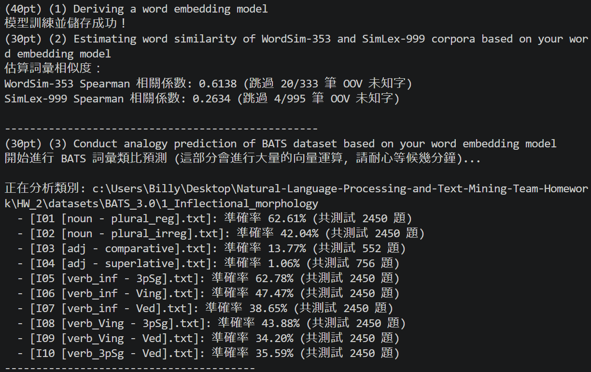
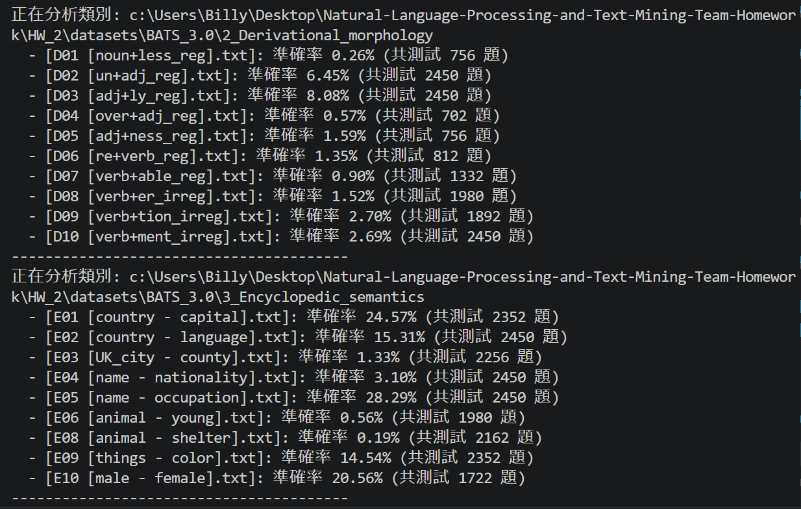
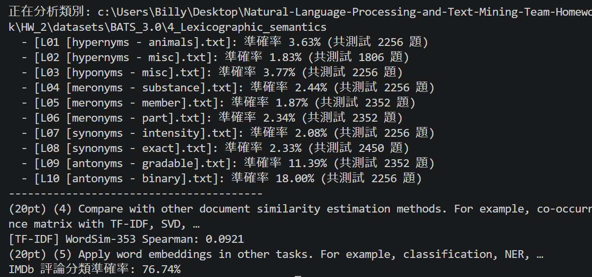

# 自然語言HW2

## 小組隊員
- 112590059 資工三 傅啟碩 (50%)
- 112590435 資工三 詹東儒 (50%)

## 系統需求
- Python 3.8 以上
- 其他依賴套件請參考 `requirements.txt`

## 安裝與使用

1. **安裝套件**
```bash
pip install -r requirements.txt
````

2. **下載 datasets**
   請手動點擊以下連結下載資料集，並將檔案解壓縮到專案資料夾`datasets`。

* [aclImdb](https://ai.stanford.edu/~amaas/data/sentiment/)
* [BATS_3.0](http://vecto.space/projects/BATS/)
* [SimLex-999](https://fh295.github.io/simlex.html)
* [wordsim353](https://gabrilovich.com/resources/data/wordsim353/wordsim353.html)

### 資料夾結構示意

datasets 結構示意，解壓後的結構應該像這樣：

```
datasets/
├─ aclImdb/
│  ├─ ...
├─ BATS_3.0/
│  ├─ ...
├─ SimLex-999/
│  ├─ ...
├─ wordsim353/
│  ├─ ...
```

3. **執行程式**

```bash
python Embedding_Lab.py
```

## 展示螢幕截圖




