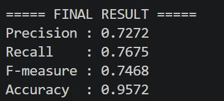

# 自然語言處理 HW3 - Named Entity Recognition (NER)

## 小組隊員
- 112590059 傅啓碩 (100%)

## 系統需求
- Python 3.8 以上
- 其他依賴套件請參考 `requirements.txt`

## 安裝與使用

1. **安裝套件**

```bash
pip install -r requirements.txt
````

2. **使用 BTC Dataset**

https://github.com/juand-r/entity-recognition-datasets/tree/master/data/BTC

資料夾為以下結構：

```text
HW_3/
│
├── BTC/
│   └── CONLL-format/
│       └── data/
│           ├── a.conll
│           ├── b.conll
│           ├── e.conll
│           ├── f.conll
│           ├── g.conll
│           └── h.conll
│
├── screenshots/
│       └── 1.png
├── results/
├── btc_ner_model/
├── app.py
├── requirements.txt
└── README.md
```

3. **執行程式**

```bash
python app.py
```

## 模型說明

本作業使用：

* BERT (`bert-base-cased`)
* Token Classification
* BIO / IOB2 格式標註

辨識以下 Named Entity：

* PER
* ORG
* LOC

## 評估指標

程式最後會輸出：

* Precision
* Recall
* F-measure (F1-score)
* Accuracy

## 展示螢幕截圖


